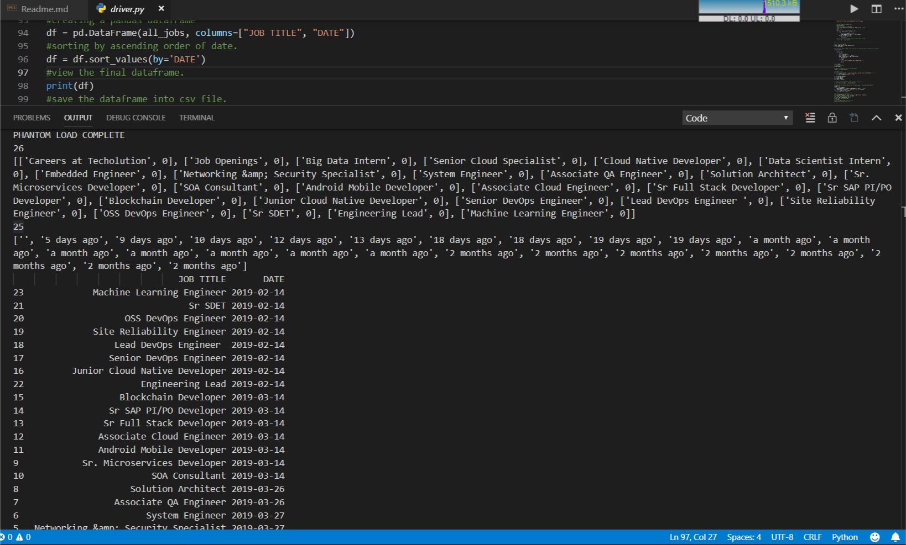

## Driver.py

### Instructions :
1. Make sure that [chromedriver.exe](chromedriver.exe) is in same dir as [driver.py](driver.py).
2. Installation of the following packages:      
    (can be installed through pip)      
    a. Selenium     
    b. BeautifulSoup4       
    c. pandas       
    d. timestring       
3. Final Result : [Techolution.csv](Techolution.csv)

### Reasoning for the approach:

#### 1. Why selenium ?

Using simple `urllib` or `request` library along with `BeautifulSoup4` will not give results for the jobs and they are inside a canvas and I will have to write function to parse data dynamically, which turns into a slow process.
But selenium has inbuilt architecture for parsing dynamic contents as well as static contents, therefore using selenium was my FIRST choice.            
And also page parsed through selenium can also be converted into a BS4 object which is easier and faster to work with.

#### 2. Using Chrome driver
It has simple usage and also is stable.

#### 3. get_jobs() method

This method was necessary because sometimes, there are some parsing errors due to client connectioon, therefore I needed a function which would let me call it until some condition, here getting the jobs, is fulfilled.       

So this function is called and it returns jobs and the soup object.

#### 4. Getting the dates

There are many ways to get the dates from the soup object, like using regex, or using find by tag.
But I converted it into string object and used `split()` attribute of string to get the dates. Why ?

    a. Faster than other methods. It takes 3 milli-seconds to parse the string, but through regex and finding by tags it takes more than 20 milli-seconds.
    b. Less lines of code and easy to understand.

#### 5. Converting into datetime
The date that I got from BS4 object was string, so I converted it into datetime object using `timestring` package, so that it would be easier to sort and use further.

#### 5. Dataframe
Used the list of jobs and datetime to make a `pandas` dataframe and converted into a [csv](Techolution.csv) file.

### Image of Output

